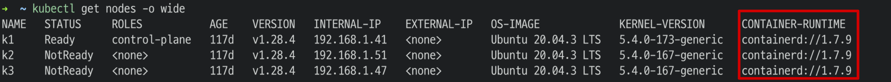

# kube-agent Helm Chart 배포 및 설치 가이드

## 사전 환경 테스트
- 아래 명령어로 helm 버전 조회, 3.x 이상 지원
```shell
helm version
```
> version.BuildInfo{Version:"v3.x", GitCommit:"xxx", GitTreeState:"clean", GoVersion:"go1.20.8"}
- whatap helm repo 에 대한 네트워크 연결 테스트
```shell
curl https://whatap.github.io/helm/ping
```
> pong

## chart 설치
1. 와탭 Helm 레포지터리 추가
```shell
helm repo add whatap https://whatap.github.io/helm/
helm repo update
```
2. values.yaml(설치에 필요한 기본 설정파일) 생성
- 사용자 CONTAINER-RUNTIME 확인
```shell
kubectl get nodes -o wide
```
> 
- values.yaml 
```yaml
containerRuntime: #CONTAINER-RUNTIME
  whatap:
    license: #WHATAP-LICENESE-KEY
    host: "13.124.11.223/13.209.172.35"
    port: "6600"
```

3. 에이전트 어플리케이션 설치  

에이전트를 처음 설치하는 사용자는 아래와 같이 설치
```shell
helm install whatap-kube-agent whatap/kube -f values.yaml
```
___기존 와탭 쿠버네티스 에이전트 사용자인 경우 clean install 을 위해 아래 명령어 입력___  
```shell
kubectl delete ns whatap-monitoring
kubectl delete clusterrole whatap
kubectl delete clusterrolebinding whatap
helm install whatap-kube-agent whatap/kube -f values.yaml
```
---
## 에이전트 업데이트 및 삭제
- release 업그레이드(와탭 쿠버네티스 에이전트 어플리케이션 업데이트)
```shell
helm upgrade whatap-kube-agent whatap/kube -f values.yaml
```
- release 삭제(와탭 쿠버네티스 에이전트 어플리케이션 삭제)
```shell
helm uninstall whatap-kube-agent
```

---
## 트러블 슈팅
### 문제: "whatap" already exists with the same configuration, skipping
#### 원인
- 이미 `whatap` 이라는 이름으로 다른 Helm 레포지터리가 추가되어 있는 경우.
#### 해결방법
- 기존에 존재하는 `whatap` 레포지터리 삭제후 설치 진행
```shell
helm repo remove whatap
```

### 문제: "Error: INSTALLATION FAILED: Unable to continue with install: Namespace "whatap-monitoring" in namespace "" exists and cannot be imported into the current release"
#### 원인:
- 이미 클러스터에 `whatap-monitoring` 이라는 네임스페이스가 존재, 사용자가 yaml 로 와탭 쿠버 에이전트를 이미 설치한 경우 발생
#### 해결방법 
- 기존에 존재하는 `whatap-monitoring` 및 관련 리소스 삭제

```shell
kubectl delete namespace whatap-monitoring
kubectl delete clusterrolebinding whatap
kubectl delete clusterrole whatap
```

### 문제: "Error: INSTALLATION FAILED: Unable to continue with install: ClusterRole "whatap" in namespace "" exists and cannot be imported into the current release"
#### 원인:
- 클러스터에 `clusterrole`,`clusterrolebinding` 리소스가 이미 존재
#### 해결방법
- 기존에 존재하는 관련 리소스 삭제
```shell
kubectl delete clusterrolebinding whatap
kubectl delete clusterrole whatap
```

---

## 추가 옵션 설정
와탭 쿠버네티스 에이전트를 설정하기 위한 `values.yaml` 파일 설정 항목입니다.

### 주요 설정 항목
`values.yaml` 파일에서 사용자가 수정할 수 있는 주요 설정 항목 
Whatap, 컨테이너 런타임 선택, 에이전트 배포를 위한 `daemonSet`,`deployment`에 대한 옵션 설명

| Key | Type | Default Value | Description                                               |
|-----|------|---------------|-----------------------------------------------------------|
| `whatap.license` | String | `# <license-key>` | Whatap 라이센스 키                                             |
| `whatap.host` | String | `# <whatap-server-host>` | Whatap 서버의 호스트 주소                                         |
| `whatap.port` | Int | `# <whatap-server-port>` | Whatap 포트 번호                                              |
| `containerRuntime` | String | `"docker"` | 사용 중인 컨테이너 런타임. `"docker"`, `"containerd"`, `"crio"` 중 선택 |
| `daemonSet.name` | String | `whatap-node-agent` | DaemonSet의 이름                                             |
| `daemonSet.label` | String | `whatap-node-agent` | DaemonSet에 지정할 라벨                                         |
| `daemonSet.initContainers.nodeDebugger.enabled` | Bool | `true` | Whatap 노드 디버거 컨테이너 활성화 여부                                 |
| `daemonSet.containers.nodeHelper.image` | String | `whatap/kube_mon` | nodeHelper 컨테이너의 이미지.                                     |
| `daemonSet.containers.nodeHelper.requests.memory` | String | `100Mi` | nodeHelper MEMORY request                                 |
| `daemonSet.containers.nodeHelper.requests.cpu` | String | `100m` | nodeHelper CPU request                                    |
| `daemonSet.containers.nodeHelper.limits.memory` | String | `350Mi` | nodeHelper MEMORY limit                                   |
| `daemonSet.containers.nodeHelper.limits.cpu` | String | `200m` | nodeHelper CPU limit                                      |
| `daemonSet.containers.nodeAgent.image` | String | `whatap/kube_mon` | nodeAgent 컨테이너의 이미지                                       |
| `daemonSet.containers.nodeAgent.requests.memory` | String | `300Mi` | nodeAgent MEMORY request                                  |
| `daemonSet.containers.nodeAgent.requests.cpu` | String | `100m` | nodeAgent CPU request                                     |
| `daemonSet.containers.nodeAgent.limits.memory` | String | `350Mi` | nodeAgent MEMORY limit                                    |
| `daemonSet.containers.nodeAgent.limits.cpu` | String | `200m` | nodeAgent CPU limit                                       |
| `deployment.name` | String | `whatap-master-agent` | Deployment의 이름                                            |
| `deployment.label` | String | `whatap-master-agent` | Deployment에 지정할 라벨                                        |
| `deployment.replicas` | Int | `1` | Deployment의 replica 수                                     |
| `deployment.containers.controlPlaneHelper.enabled` | Boolean | `true` | whatap-control-plane-helper 컨테이너를 활성화 여부                  |
| `deployment.containers.controlPlaneHelper.image` | String | `"whatap/kube_mon"` | controlPlaneHelper 컨테이너의 이미지                              |
| `deployment.containers.controlPlaneHelper.port` | String | `9496` | controlPlaneHelper 컨테이너의 포트 번호입니다                         |
| `deployment.containers.controlPlaneHelper.resources.requests.memory` | String | `"300Mi"` | controlPlaneHelper 컨테이너 MEMORY request                    |
| `deployment.containers.controlPlaneHelper.resources.requests.cpu` | String | `"100m"` | controlPlaneHelper 컨테이너 CPU request                       |
| `deployment.containers.controlPlaneHelper.resources.limits.memory` | String | `"350Mi"` | controlPlaneHelper 컨테이너 MEMORY limit                      |
| `deployment.containers.controlPlaneHelper.resources.limits.cpu` | String | `"200m"` | controlPlaneHelper 컨테이너 CPU limit                         |
| `deployment.containers.masterAgent.name` | String | `whatap-master-agent` | masterAgent 컨테이너 이름                                       |
| `deployment.containers.masterAgent.image` | String | `"whatap/kube_mon"` | masterAgent 컨테이너 이미지                                      |
| `deployment.containers.masterAgent.port` | Int | `6600` | masterAgent 컨테이너 포트 번호                                    |
| `deployment.containers.masterAgent.resources.requests.memory` | String | `"300Mi"` | masterAgent 컨테이너 MEMORY request                           |
| `deployment.containers.masterAgent.resources.requests.cpu` | String | `"100m"` | masterAgent 컨테이너 CPU request                              |
| `deployment.containers.masterAgent.resources.limits.memory` | String | `"350Mi"` | masterAgent 컨테이너 MEMORY limit                             |
| `deployment.containers.masterAgent.resources.limits.cpu` | String | `"200m"` | masterAgent 컨테이너 CPU request                              |
| `gpuEnabled`       | Boolean | `false`             | Enables GPU if set to `true`. This is used to enable hardware acceleration for applications that support it. |
| `istioEnabled`     | Boolean | `false`             | Enables Istio automatic injection if set to `true`. This is useful for deploying applications that benefit from Istio's service mesh capabilities. |
| `k8sOldVersion`    | Boolean | `false`             | Set to `true` if using an older version of Kubernetes. This helps in managing compatibility issues with deprecated features. |

### 구성 예시

`values.yaml` 을 이용한 주요 구성 수정 방법

### Whatap 기본 설정

```yaml
whatap:
  license: "라이선스 키 입력"
  host: "와탭 수집서버 호스트 입력"
  port: "와탭 수집서버 포트 입력"
```

---

## 배포

### 1. 차트 검사- 차트 형식, 문법 사전테스트
```shell
helm lint charts/kube
```

> ==> Linting . 1 chart(s) linted, 0 chart(s) failed

### 2. 차트 디버깅- 실제 어플리케이션 배포시 문제 발생 여부 체크
```shell
helm install whatap-kube-agent charts/kube --dry-run --debug
```

### 3. 차트 패키징
```shell
helm package charts/kube/
```

### 3.현재 디렉토리에 있는 Helm 차트로부터 인덱스 파일 생성
```shell
helm repo index --url https://whatap.github.io/helm/ --merge index.yaml .
```

### 기타 도움말

```shell
## revision 에서 사용하는 values.yaml 확인
helm get values whatap-kube-agent --revision=<조회할 revision>

```
---
## 차트 구조
```shell
└── kube
    ├── Chart.yaml
    ├── README.md
    ├── index.yaml
    ├── templates
    │   ├── clusterrole.yaml
    │   ├── clusterrolebinding.yaml
    │   ├── configmap-master.yaml
    │   ├── configmap-node.yaml
    │   ├── daemonset.yaml
    │   ├── deployment.yaml
    │   ├── namespace.yaml
    │   ├── service.yaml
    │   └── serviceaccount.yaml
    ├── values.yaml
    └── kube-*.tgz
```

